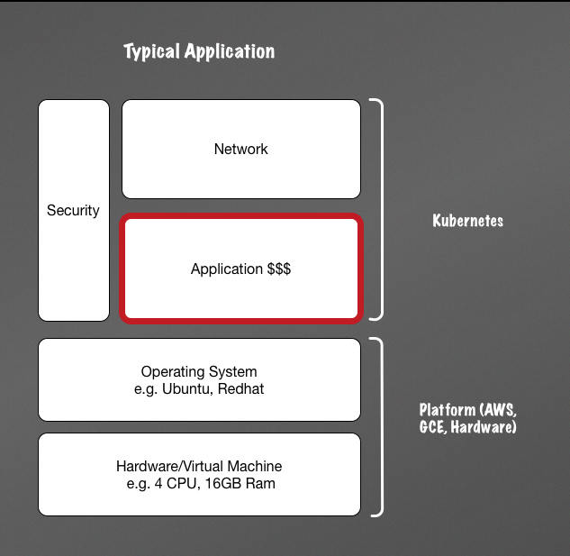

# Kubernetes and Elixir

### Jeffrey Chan
@fa[twitter gp-contact](@jgmchan)
@fa[github gp-contact](https://github.com/jgmchan)
@fa[envelope gp-contact](jgmchan@gmail.com)

---
# What is Kubernetes?

---?image=/assets/image/so_hot_right_now.jpg&size=auto 80%

---

> "Kubernetes is a portable, extensible open-source platform for managing containerized workloads and services, that facilitates both declarative configuration and automation." [Kubernetes Documentation](https://kubernetes.io/docs/concepts/overview/what-is-kubernetes/)

---
## My interpretation

- Distributed platform to run anything, as long as it's containers
- Batteries included (networks, security, service discovery, secrets)
- "Easier" to automate because you don't need to script

---
## Basic Platform Concepts
 

  

  
  

  

      <ul>
       <li>All applications are just some sort of task/worker (does things), workloads may be different</li>
       <li>Needs to run on something (server, local desktop, etc.)</li>
       <li>Usually needs to talk to other things through via network</li>
       <li>Would be good if it's secure</li>
      <ul>
  

---
## This is what Kubernetes does

- Takes care of all these things for us e.g.
  * What machine does the task run on?
  * How does each group of tasks find/talk to each other?
  * How does the clients talk to us?
  * How do I protect each workload?

---
## Kubernetes Concepts - Workloads

* Pods:
  * Smallest Logical Unit (Usually 1 container per Pod)
  * Tasks/Worker containers (Does the work)

* Controllers:
  * Deploys a set of pods in particular ways as required by the application, e.g.
    * Deployments - Typical Service, long running replicated apps with multiple instances, Blue green
    * Jobs - These are just single tasks which runs to completion X number of times
    * Cronjobs - Tasks which run on schedule

---
## Digression: Docker Containers

* Different types of container like LXC, Solaris Zones, Rkt
* Think of it as a packaging system for your app and all it's dependencies (including OS libraries), which also contains
  hooks to run the application safely inside the package (container)
* Not a Virtual Machine
* Images are sharable through a "Docker Registry", e.g. [Dockerhub](https://hub.docker.com/), [Google Container Engine (GKE)](https://cloud.google.com/kubernetes-engine/) or your own internal registry.
    * This means I can build an image which anyone (or system) can pull down and run, provided they have Docker installed
    * In general, this means I can build and compile something locally, test it and push it up and be fairly sure it will work in other places

---
## Kubernetes Concepts - Services, Load Balancing and Networking

* Quite complicated but the basic concepts are:
  * Services - an endpoint to sit in front of your workload to be accessed internally/externally
  * Ingress - Internal rules to control what can and cannot be accessed, e.g. paths/routes. Like NGINX configuration
  * DNS - A way to find other services in the cluster

---
## Elixir and Kubernetes

* BEAM VM and Kubernetes offer similar capabilities:
  * Restart tasks which are dying
  * Distributed across multiple nodes
  * Service Discovery
  * Hot Upgrades (sort of in Kubernetes)

* Really, they are orthogonal to each other, they can co-exist peacefully

* Kubernetes is designed for general workloads (any language), Day 2 Operations and Enterprise
* BEAM VM is only for Beam languages and does not do things like network security, IP management.

---
## Why use Docker and Kubernetes

* When you have multiple
